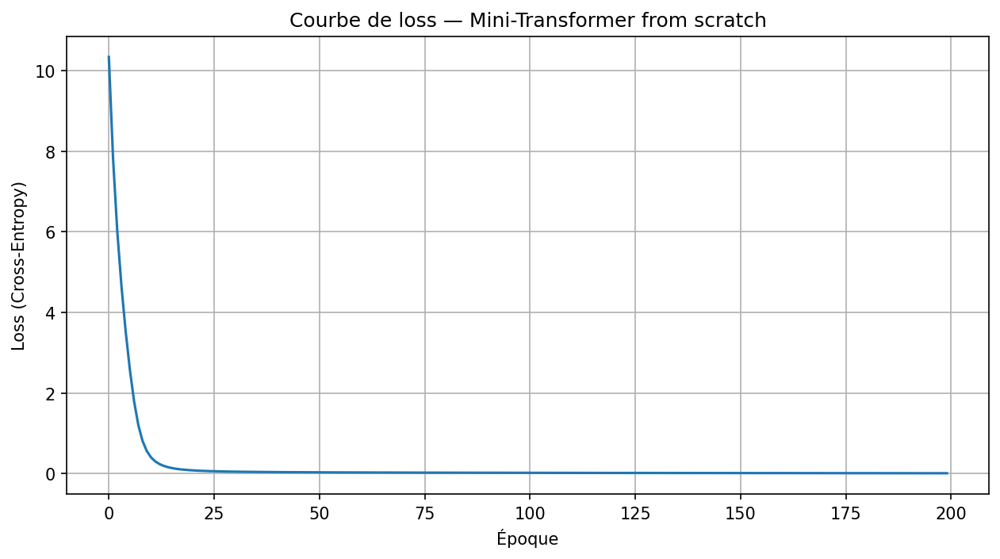
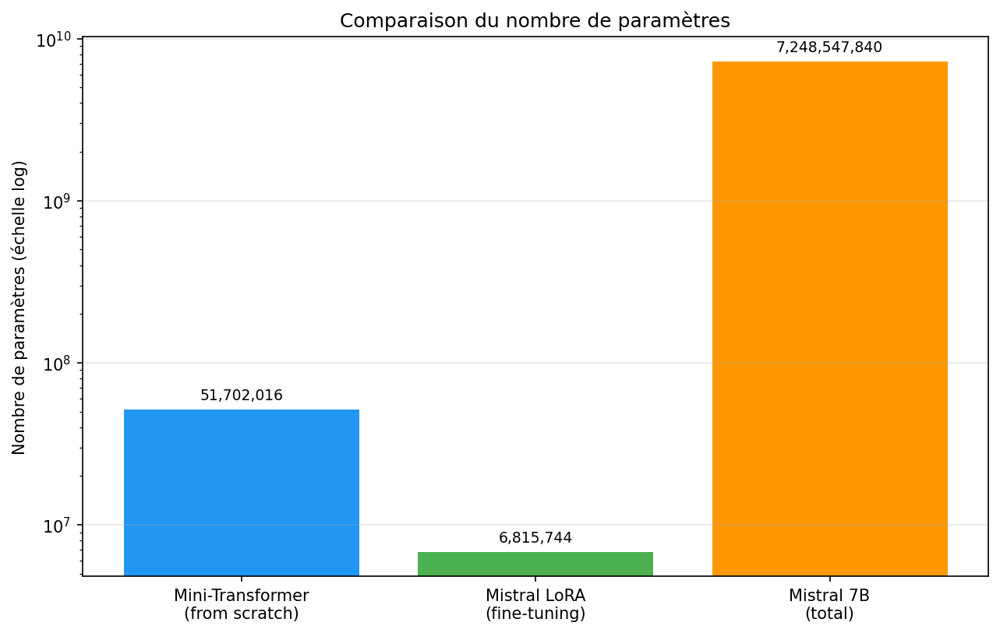
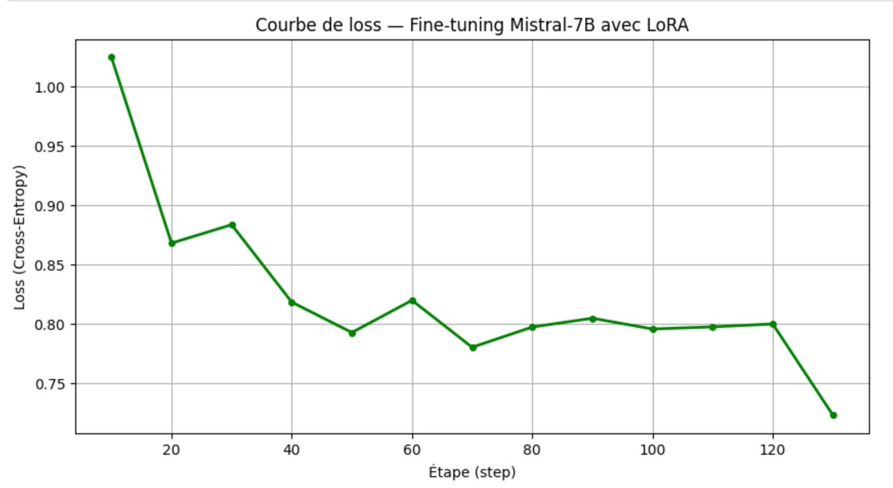

# Transformer Architecture From Scratch & Mistral-7B LoRA Fine-Tuning

[](https://www.python.org/)
[](https://pytorch.org/)
[](https://huggingface.co/bachir6c/mistral-mam-lora)
[](https://github.com/huggingface/peft)
[](LICENSE)

An in-depth natural language processing project combining first-principles architectural understanding with modern parameter-efficient fine-tuning:
1. **From-Scratch PyTorch Implementation**: Complete modular implementation of the Transformer architecture based on *Attention Is All You Need*.
2. **PEFT with LoRA on Mistral-7B**: Fine-tuning [Mistral-7B-v0.1](https://huggingface.co/mistralai/Mistral-7B-v0.1) on the [GSM8K](https://huggingface.co/datasets/openai/gsm8k) mathematical reasoning dataset, adapting only **0.094%** of total model weights.

**Fine-Tuned Adapter on Hugging Face:** [bachir6c/mistral-mam-lora](https://huggingface.co/bachir6c/mistral-mam-lora)

---

## Part 1 — Building a Transformer From Scratch

To master the underlying mathematical and tensor operations of modern Large Language Models, all core components were implemented in raw PyTorch without high-level abstractions:

| Component | Class | Architectural Details |
| :--- | :--- | :--- |
| **Token Embedding** | `Embedding` | Token-to-vector projection ($d_{model} = 512$) |
| **Positional Encoding** | `PositionalEncoding` | Sinusoidal frequency-based position encodings |
| **Multi-Head Attention** | `MultiHeadAttention` | Scaled dot-product attention across $h = 8$ heads |
| **Position-wise FFN** | `FeedForward` | Two-layer linear projections with ReLU ($d_{ff} = 2048$) |
| **Residual Block** | `TransformerBlock` | Pre-layer normalization & residual skip connections |
| **Full Architecture** | `MiniTransformer` | $N = 6$ stacked encoder/decoder blocks |

### Implementation & Training Dynamics
* **Trainable Parameters**: 51,702,016 parameters.
* **Loss Convergence**: Dropped from **10.46 down to 0.02** over 200 epochs, demonstrating mathematical correctness and gradient flow stability.



---

## Part 2 — Parameter-Efficient Fine-Tuning (LoRA) on Mistral-7B

### Qualitative Reasoning Evaluation

Below is a direct comparison between base Mistral-7B and the fine-tuned LoRA adapter on a multi-step word problem from GSM8K:

> **Prompt:**  
> `### Question:`  
> `Janet has 24 apples. She gives half to her friend and eats 3. How many does she have left?`  
> `### Answer:`

* **Base Mistral-7B:** Generates unstructured or generic continuation without strictly isolating the sequence of arithmetic steps.
* **Fine-Tuned Mistral (LoRA - Ours):** Adopts the target step-by-step reasoning pattern (*Chain-of-Thought*):
  ```text
  Janet starts with 24 apples.
  She gives half to her friend: 24 / 2 = 12 apples.
  She has 12 apples left.
  Then she eats 3: 12 - 3 = 9.
  #### 9

Fine-tuning the 7.2B-parameter Mistral architecture using **Low-Rank Adaptation (LoRA)** on the **GSM8K** mathematical reasoning dataset on constrained hardware (NVIDIA Tesla T4).

### Parameter Efficiency Comparison
By freezing base model weights and inserting low-rank decomposition matrices ($r=8, \alpha=16$) targeting key linear projections (`q_proj`, `k_proj`, `v_proj`, `o_proj`), trainable parameter count was slashed by over 1,000×:

| Model Setup | Total Parameters | Trainable Parameters | Trainable % |
| :--- | :---: | :---: | :---: |
| Full Mistral-7B | 7,241,732,096 | 7,241,732,096 | 100.0% |
| **LoRA Adapter (Ours)** | 7,248,547,840 | **6,815,744** | **0.094%** |



### Training Configuration & Optimization
* **Hardware**: Single NVIDIA Tesla T4 (16 GB VRAM)
* **Optimization Framework**: Hugging Face `transformers`, `peft`, and `trl` (SFTTrainer)
* **Precision**: Bfloat16 (BF16)
* **Hyperparameters**:
  * Rank ($r$): 8 | Alpha ($\alpha$): 16 | Dropout: 0.05
  * Batch Size: 2 | Gradient Accumulation: Enabled
  * Learning Rate: $2 \times 10^{-4}$ | Steps: 200

### Loss Convergence
Training loss declined consistently from **1.025 to 0.722 (-29.6%)**, confirming effective weight adaptation to multistep reasoning prompt structures.



---

## Repository Structure

```text
├── transformers.ipynb         # Pure PyTorch Transformer implementation & validation
├── fine_tuning.ipynb          # End-to-end Mistral-7B LoRA fine-tuning pipeline
├── loss_mini_transformer.png  # Loss curve for Part 1
├── loss_fine_tuning.png       # Loss curve for Part 2
├── comparaison_parametres.png # Trainable parameter comparison chart
└── README.md

Key Takeaways & Perspectives
Low-Rank Efficiency: Demonstrated that adapting < 0.1% of weights is sufficient to steer a 7B foundation model toward mathematical reasoning formats without catastrophic forgetting.

Hardware Constrained Fine-Tuning: Successfully established a reproducible pipeline executing within the 16 GB VRAM budget of a cloud T4 instance.

Next Steps: Scaling training duration across full dataset epochs, evaluating zero-shot mathematical benchmarks (MATH / GSM8K accuracy testing), and serving adapters via a low-latency vLLM endpoint.

References
Vaswani et al. (2017) — Attention Is All You Need (NeurIPS)

Hu et al. (2021) — LoRA: Low-Rank Adaptation of Large Language Models

Jiang et al. (2023) — Mistral 7B